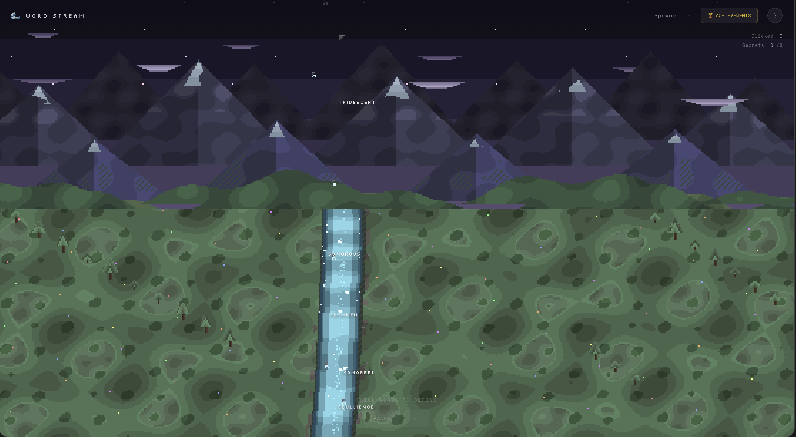

# Word Stream

A small pixel-art “dictionary river.” Words drift down a mountain stream, and you can click them to see what they mean.



## Features

- 100+ words from different languages (English, Japanese, Danish, Portuguese, German, Welsh, etc.)
- 8 rare “secret” words that appear occasionally
- 12 simple in-game achievements
- Pixel-art mountain and river scene rendered on canvas
- Works on desktop and mobile
- No frameworks or libraries – HTML, CSS, and JavaScript only

## How it Works

1. Words flow down the river.
2. Click a word to open its definition.
3. Rare words show up with a different visual treatment.
4. Achievements unlock as you click and explore.
5. You can pause or change the speed.

## Achievements

| Icon | Name              | Description                  |
|------|-------------------|------------------------------|
| 👆   | First Steps       | Click your first word        |
| 🔍   | Curious Mind      | Click 5 words                |
| 📖   | Word Collector    | Click 15 words               |
| 📚   | Lexicon Explorer  | Click 30 words               |
| 🎓   | Word Scholar      | Click 50 words               |
| 📜   | Vocabulary Master | Click 75 words               |
| 🧙   | Word Wizard       | Click 100 words              |
| 🏛️  | Living Dictionary | Click 150 words              |
| ✨   | Secret Finder     | Find a secret word           |
| 🔮   | Mystery Seeker    | Find 3 secret words          |
| 🌟   | Hidden Knowledge  | Find 5 secret words          |
| 👑   | Keeper of Secrets | Find all 8 secret words      |

## Controls

- Click – select a word and show its definition
- Space – pause / resume
- Escape – close panels
- Speed button – switch between 1x / 2x / 3x

## Quick Start

### GitHub Pages

- Fork the repo
- Enable GitHub Pages in the repo settings
- Open the published URL

### Local

```bash
git clone https://github.com/yourusername/word-stream.git
cd word-stream
# then open index.html in your browser
